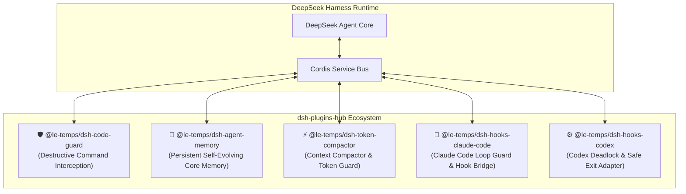

# DeepSeek Harness Plugins Hub (`dsh-plugins-hub`)

<div align="center">

[](https://github.com/le-temps/dsh-plugins-hub/actions)
[](LICENSE)
[](https://github.com/deepseek-ai/deepseek-harness)
[](https://github.com/topics/dsh-plugin)

**English** | [中文说明](#-中文文档)

*A community-driven collection of advanced, production-ready plugins for the [DeepSeek Harness](https://github.com/deepseek-ai/deepseek-harness) ecosystem.*

</div>

---

## 🏗️ Architecture & Philosophy

DeepSeek Harness is built on the [Cordis](https://cordis.js.org/) architecture, where **"Everything is a Plugin"**. 
Instead of maintaining fragmented forks of the core engine, `dsh-plugins-hub` provides battle-tested, drop-in plugins that seamlessly mount via your `cordis.yml` configuration.



---

## 📦 Available Plugins

| Package | Category | Description | Status |
| :--- | :--- | :--- | :--- |
| [`@le-temps/dsh-token-compactor`](./packages/token-compactor) | **Context / Performance** | Context window compactor & smart token guard. Prevents context overflow & cuts token costs. | 🚀 Production |
| [`@le-temps/dsh-code-guard`](./packages/code-guard) | **Security / Safety** | Intercepts `rm -rf /`, fork bombs, credential leaks, and provides structured agent remediation. | 🚀 Production |
| [`@le-temps/dsh-agent-memory`](./packages/agent-memory) | **Memory / Autonomy** | Long-term core memory inspired by MemGPT with self-evolution across sessions. | 🚀 Production |
| [`@le-temps/dsh-hooks-claude-code`](./packages/hooks-claude-code) | **Interoperability** | Enhanced hook bridge for Claude Code with infinite loop guard & lifecycle control. | 🚀 Production |
| [`@le-temps/dsh-hooks-codex`](./packages/hooks-codex) | **Interoperability** | Enhanced hook bridge for Codex preventing deadlocks on tool output parsing. | 🚀 Production |

---

## 🛠️ Quick Start

### 1. Install Desired Plugin(s)

```bash
# Example: Install memory and security guard plugins
npm install @le-temps/dsh-agent-memory @le-temps/dsh-code-guard @le-temps/dsh-token-compactor
```

### 2. Mount in `cordis.yml`

```yaml
plugins:
  - @le-temps/dsh-code-guard:
      mode: strict
      protectedPaths:
        - ./.env
        - ~/.ssh

  - @le-temps/dsh-token-compactor:
      enabled: true
      recentTurnsToPreserve: 6
      maxToolOutputChars: 600

  - @le-temps/dsh-agent-memory: {}
```

---

## 🌐 中文文档

欢迎来到 **DeepSeek Harness 插件中心** (`dsh-plugins-hub`)！

本项目致力于为 [DeepSeek Harness](https://github.com/deepseek-ai/deepseek-harness) 生态提供生产级、即插即用的核心增强插件：

- **⚡ 上下文智能压缩与 Token 守卫 (`dsh-token-compactor`)**：自动折叠历史冗余输出，保留关键报错与最新轮次，大幅降低 Token 消耗并杜绝 Context 溢出。
- **🛡️ 危险命令与安全防御守卫 (`dsh-code-guard`)**：拦截 `rm -rf /`、系统盘擦除、Fork 炸弹与私密凭据泄露，并向 Agent 注入可自愈的修正指引。
- **🧠 跨会话长期自进化记忆 (`dsh-agent-memory`)**：受 MemGPT 启发，赋予 Agent 自主记录偏好、项目架构与教训反思的能力。
- **🔄 Claude Code / Codex 钩子桥接与死循环防御 (`dsh-hooks-*`)**：保障跨工具生态调用时的稳定性与安全退出机制。

---

## 🤝 Contributing

Contributions are welcome! Please follow these guidelines:

1. Check our [Issue Templates](https://github.com/le-temps/dsh-plugins-hub/issues/new/choose) to report bugs, request features, or propose a new plugin RFC.
2. Submit Pull Requests following our [PR Template](.github/PULL_REQUEST_TEMPLATE.md).
3. Ensure all tests pass:
   ```bash
   pnpm test
   ```

---

## 📄 License

This repository is licensed under the [MIT License](LICENSE).
